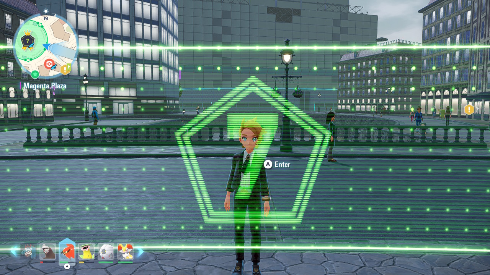

# Legends: Z-A: Wild Zone Entrance

This guide covers Wild Zone Entrance in Pokémon Legends: Z-A. This mode automates overworld spawns until a `StopCondition` is matched.

## Setup

1. Set `Overworld` -> `Mode` to `WildZoneEntrance`
2. Position your character as shown in the screenshot below:
    

## Notes

The settings `StopOnMaxShiniesStored` and `OverworldSpawnCheck` are only used when the `StopCondition` contains records with `ShinyTarget` set to `AnyShiny`, `StarOnly`, or `SquareOnly`. Since there is a separate place in memory where the shinies are stored (maximum of 10), the bot doesn't have to save after each round.