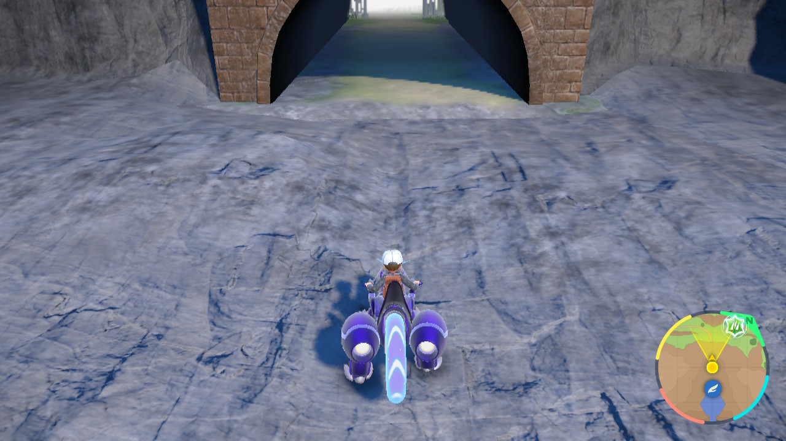

# Scarlet/Violet: Partner Mark Bot Guide

The Partner Mark bot automates the process of obtaining the Partner Mark for all Pokémon in your party by continuously running in circles.

## Setup and Operation

1.  **Travel**: Fly to **Zero Gate**.
2.  **Mount**: Mount your ride Pokémon.
3.  **Positioning**: Walk or ride a few steps towards the exit and position your character as shown in the screenshot below:
    
    *Ensure your character is positioned to allow for continuous circular movement without obstruction.*
4.  **Start Bot**: Launch SysBot.NET and start the Partner Mark bot.
5.  **Wait**: The bot will run until all party members have acquired the Partner Mark.